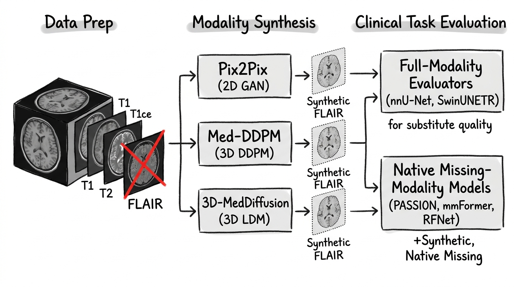
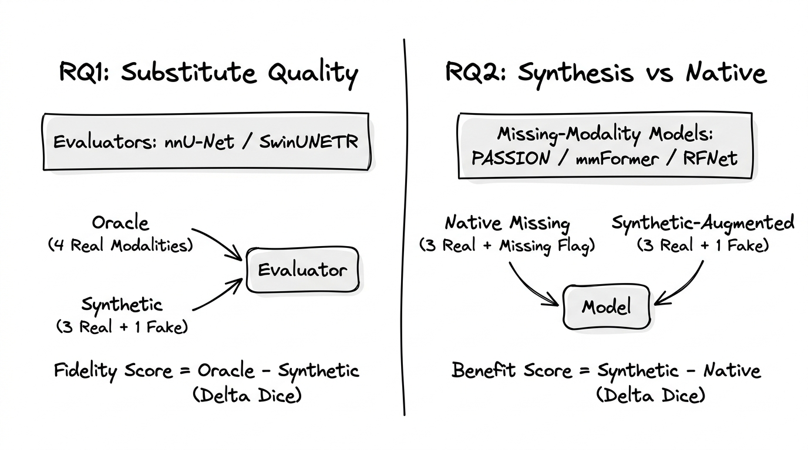
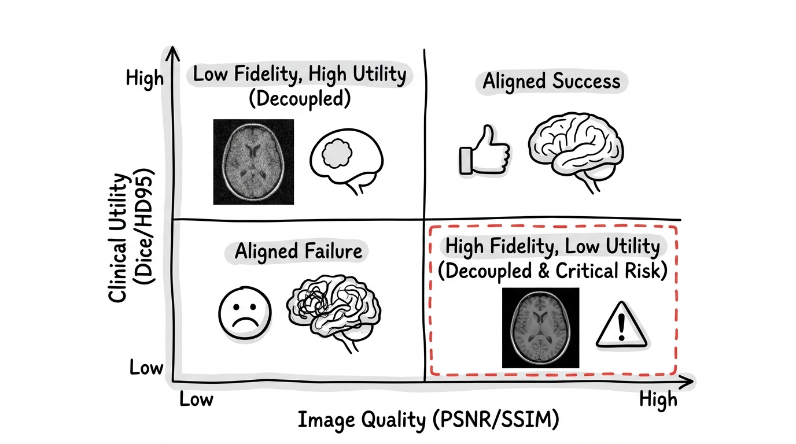

# Experiment Plan - Can Existing Generative Models Produce Viable MRI Modality Substitutes for Segmentation?

---

## Background & Motivation

Existing MRI modality synthesis research primarily evaluates image reconstruction quality or introduces new generation methods. There is limited systematic evidence on whether current generators produce synthetic modalities that are suitable substitutes for real MRI sequences in downstream segmentation, particularly across both conventional segmentation models and dedicated missing-modality architectures. Furthermore, the relationship between image fidelity metrics and downstream clinical utility remains poorly understood.

## Study Type

**Empirical comparative and methodological study.** No novel models are proposed. All generators and segmenters are existing published methods. The contributions are:

1. A controlled, within‑model comparative evaluation of the "synthesise then segment" paradigm against purpose‑built missing‑modality architectures.
2. A methodological evaluation of whether traditional pixel-level reconstruction metrics (PSNR, SSIM) are reliable predictors of downstream clinical task performance (segmentation).
3. A systematic failure-mode analysis characterizing the physical/biological reasons behind generative model translation failures.

## Research Questions

| #             | Question                                                                                                                                      | How tested                                                                                                                             |
| ------------- | --------------------------------------------------------------------------------------------------------------------------------------------- | -------------------------------------------------------------------------------------------------------------------------------------- |
| **RQ1** | Do existing generative models produce synthetic modalities that are viable substitutes for real ones in downstream segmentation?              | Freeze a full‑modality segmenter. Compare its performance on (4 real) vs (3 real + 1 synthetic). Small Dice drop = viable substitute. |
| **RQ2** | Do models with built‑in missing‑modality handling benefit from receiving a synthesised modality instead of using their native compensation? | Same missing‑modality model, compared against itself: native 3‑channel mode vs 3 real + 1 synthetic as full 4‑channel input.        |
| **RQ3** | Do traditional pixel-level quality metrics (PSNR, SSIM) correlate with and predict downstream segmentation performance (Dice, HD95)?          | Compute Pearson/Spearman correlation coefficients between (PSNR, SSIM) and (Dice, HD95) across all test cases and scenarios.           |

> [!IMPORTANT]
> **The generators are the subject of evaluation, not a contribution.** Segmentation models serve as measuring instruments — downstream, task‑based quality metrics for the synthetic modality. We are not benchmarking segmenters against each other, nor proposing new generative architectures.

---

## 1 Dataset & Pre‑processing

### 1.1 BraTS 2020

| Property         | Detail                                                                                                              |
| ---------------- | ------------------------------------------------------------------------------------------------------------------- |
| Modalities       | T1, T1ce, T2, FLAIR (all present per patient).                                                                      |
| Annotations      | Expert‑revised masks for WT, TC, ET.                                                                               |
| Size             | 369 training cases.                                                                                                 |
| Why this dataset | Standard benchmark; full‑modality availability enables controlled missingness; official nnU‑Net v2 weights exist. |

### 1.2 Pre‑processing

| Step                      | Justification                                                        |
| ------------------------- | -------------------------------------------------------------------- |
| Skull‑stripping          | Removes non‑brain voxels.                                           |
| N4 bias‑field correction | Corrects RF‑coil intensity inhomogeneity.                           |
| Per‑modality z‑score    | Standardises intensity distributions across patients and modalities. |

### 1.3 Split

- **70 / 15 / 15 %** patient‑wise (≈ 259 / 56 / 54).
- Same split for all experiments.

### 1.4 Missing‑Modality Scenarios

| Scenario | Available       | Synthesised | Clinical motivation                         |
| -------- | --------------- | ----------- | ------------------------------------------- |
| S1       | T1, T1ce, T2    | FLAIR       | Most commonly absent in retrospective data. |
| S2       | T1, T2, FLAIR   | T1ce        | Contrast skipped (allergy, cost).           |
| S3       | T1ce, T2, FLAIR | T1          | Pre‑contrast T1 occasionally omitted.      |
| S4       | T1, T1ce, FLAIR | T2          | Emergency protocol.                         |

---

## 2 Generators (Evaluated Models)

| Generator                  | Type                  | Why included                                                                                    |
| -------------------------- | --------------------- | ----------------------------------------------------------------------------------------------- |
| **Pix2Pix**          | Conditional GAN (2D)  | Paired‑data GAN baseline. Fast, simple. Represents 2D GAN‑based synthesis.                    |
| **Med‑DDPM**        | DDPM (3D)             | Volumetric diffusion baseline. Represents native 3D diffusion without latent space compression. |
| **3D‑MedDiffusion** | Latent diffusion (3D) | State‑of‑the‑art 3D latent diffusion. Represents the modern LDM paradigm (fast, low-memory). |

Three generators are evaluated to avoid a simple 1-vs-1 comparison and span across GANs, native 3D diffusion, and latent 3D diffusion. They bracket the quality range. Comparing Pix2Pix (2D GAN) vs Med-DDPM (3D DDPM) vs 3D-MedDiffusion (3D LDM) allows us to analyze the combined impact of dimensionality (2D vs 3D) and generative framework (adversarial vs score-based).

### Training Protocol

- **Supervision**: paired — (available modalities) → (missing modality).
- **Losses**: adversarial + L1 + SSIM.
- **Early stopping**: validation PSNR / SSIM, patience = 20 epochs.
- **Freeze** after training. Generate synthetic modality for all val and test patients under S1–S4.

---

## 3 Experimental Design

### 3.1 RQ1 — "Can existing generators produce a viable substitute?"

The segmentation model is a **frozen downstream evaluator**. It is not being trained or adapted — it simply processes the input and returns a segmentation. The Dice/HD95 difference between oracle and synthetic input is a **task‑based quality score for the generator**.

#### Evaluators

| Model                 | Architecture                       | Why this evaluator                                                                                                                           |
| --------------------- | ---------------------------------- | -------------------------------------------------------------------------------------------------------------------------------------------- |
| **nnU‑Net v2** | Self‑configuring 3D U‑Net (CNN)  | Gold‑standard medical segmentation. Official BraTS 2020 weights → fully reproducible, no retraining.                                       |
| **SwinUNETR**   | Swin‑Transformer + U‑Net decoder | Transformer‑based evaluator. If both CNN and Transformer respond similarly to the synthetic modality, the result is architecture‑agnostic. |

> [!NOTE]
> **Why two evaluators?** If nnU‑Net shows a small Dice drop but SwinUNETR shows a large one (or vice versa), the quality of the synthetic modality is architecture‑dependent — a finding worth reporting. If both agree, the conclusion is robust.

#### Conditions (per evaluator, per scenario)

| Condition           | Input                | Role                                                                        |
| ------------------- | -------------------- | --------------------------------------------------------------------------- |
| **Oracle**    | 4 real modalities    | Ground truth performance — the standard the generator is measured against. |
| **Synthetic** | 3 real + 1 generated | Generator's output under evaluation.                                        |

#### Primary Readout

$$
\Delta\text{Dice} = \text{Dice}_{\text{oracle}} - \text{Dice}_{\text{synthetic}}
$$

- **ΔDice ≈ 0** → synthetic modality is a good substitute; it preserves segmentation‑relevant information.
- **ΔDice large** → synthetic modality loses critical information; the generator is not sufficient.

Same logic applies to ΔHD95.

---

### 3.2 RQ2 — "Does synthesis improve missing‑modality models?"

Each missing‑modality model is compared **against itself** under two input conditions.

#### Models

| Model              | Architecture                               | Why included                                                                                                |
| ------------------ | ------------------------------------------ | ----------------------------------------------------------------------------------------------------------- |
| **PASSION**  | Transformer, distillation‑based           | Missing‑modality SOTA (2024). Hardest to improve upon — if synthesis helps PASSION, it's a strong result. |
| **mmFormer** | Multi‑modal transformer, cross‑attention | Transformer missing‑modality baseline.                                                                     |
| **RFNet**    | CNN, region‑aware fusion                  | CNN missing‑modality baseline.                                                                             |

#### Conditions (per model, per scenario)

| Condition                | Input                                                   | Role                                                             |
| ------------------------ | ------------------------------------------------------- | ---------------------------------------------------------------- |
| **Native missing** | 3 real channels + missing‑modality flag                | Model's own baseline — its designed behaviour.                  |
| **+ Pix2Pix**      | 3 real + 1 Pix2Pix synthetic (full 4‑ch mode)          | Does GAN synthesis beat the model's internal compensation?       |
| **+ 3D‑MedDiff**  | 3 real + 1 3D‑MedDiffusion synthetic (full 4‑ch mode) | Does diffusion synthesis beat the model's internal compensation? |
| **Oracle**         | 4 real channels                                         | Ceiling — how much room exists above native missing?            |

#### Primary Readout

$$
\Delta\text{Dice} = \text{Dice}_{\text{synthetic}} - \text{Dice}_{\text{native missing}}
$$

- **ΔDice > 0** → synthesis helps; the generated modality carries information the model's internal mechanism cannot recover.
- **ΔDice ≈ 0** → the model's built‑in compensation is already sufficient; synthesis adds nothing.
- **ΔDice < 0** → synthetic artefacts actively interfere with the model's learned representations. Native handling is safer.

---

### 3.3 Full Condition Matrix

#### RQ1 — Substitute quality (evaluator models)

| Evaluator   | Oracle    | + Pix2Pix | + Med-DDPM | + 3D‑MedDiff |
| ----------- | --------- | --------- | ---------- | ------------- |
| nnU‑Net v2 | ✅ S1–S4 | ✅ S1–S4 | ✅ S1–S4  | ✅ S1–S4     |
| SwinUNETR   | ✅ S1–S4 | ✅ S1–S4 | ✅ S1–S4  | ✅ S1–S4     |

**2 evaluators × 4 conditions × 4 scenarios = 32 cells**

#### RQ2 — Synthesis vs native handling

| Model    | Native missing | + Pix2Pix | + Med-DDPM | + 3D‑MedDiff | Oracle    |
| -------- | -------------- | --------- | ---------- | ------------- | --------- |
| PASSION  | ✅ S1–S4      | ✅ S1–S4 | ✅ S1–S4  | ✅ S1–S4     | ✅ S1–S4 |
| mmFormer | ✅ S1–S4      | ✅ S1–S4 | ✅ S1–S4  | ✅ S1–S4     | ✅ S1–S4 |
| RFNet    | ✅ S1–S4      | ✅ S1–S4 | ✅ S1–S4  | ✅ S1–S4     | ✅ S1–S4 |

**3 models × 5 conditions × 4 scenarios = 60 cells**

**Total: 92 evaluation cells** on ~54 test patients.

---

## 4 Metrics

### 4.1 Generator Quality — Pixel‑Level

| Metric         | What it measures                                          | Role                                                                  |
| -------------- | --------------------------------------------------------- | --------------------------------------------------------------------- |
| **PSNR** | Pixel‑wise reconstruction fidelity.                      | Sanity check. High PSNR = intensities are close to real.              |
| **SSIM** | Structural similarity (luminance + contrast + structure). | Perceptual quality. Correlates better with human judgement than PSNR. |

### 4.2 Generator Quality — Task‑Level (Primary)

| Metric                      | What it measures                                                   | Role                                                                                                                          |
| --------------------------- | ------------------------------------------------------------------ | ----------------------------------------------------------------------------------------------------------------------------- |
| **Dice (WT, TC, ET)** | Volumetric overlap when downstream segmenter uses synthetic input. | **The metric that matters.** Directly measures whether the synthetic modality preserves the features a segmenter needs. |
| **HD95 (WT, TC, ET)** | Boundary accuracy under synthetic input.                           | Complements Dice — catches boundary degradation that Dice may miss.                                                          |

> [!TIP]
> **The relationship between pixel‑level and task‑level metrics is itself a finding.** If PSNR/SSIM are high but Dice drops significantly, the generator is reconstructing the wrong features — it's pixel‑accurate but not task‑relevant. If PSNR/SSIM are mediocre but Dice holds, the generator preserves the features that matter despite cosmetic imperfections.

### 4.3 Methodological Analysis (RQ3): Metric Decoupling

We analyze whether traditional image-quality metrics (PSNR, SSIM) are reliable predictors of downstream clinical utility.

| Method                                   | Objective                                                                                                                  | Rationale                                                                                                                                                                                                                                                                           |
| ---------------------------------------- | -------------------------------------------------------------------------------------------------------------------------- | ----------------------------------------------------------------------------------------------------------------------------------------------------------------------------------------------------------------------------------------------------------------------------------- |
| **Joint Metric Correlation**       | Compute Spearman's$\rho$ and Pearson's $r$ between per-patient image metrics (PSNR/SSIM) and task metrics (Dice/HD95). | Tests the hypothesis that structural synthesis fidelity correlates with segmentation task performance.                                                                                                                                                                              |
| **Outlier & Discordance Analysis** | Identify cases where:1. PSNR/SSIM is high but downstream Dice is low.2. PSNR/SSIM is low but downstream Dice is high.      | Pinpoints*why* traditional voxel-wise metrics fail. For example, a generator might perfectly reconstruct normal brain tissues (high PSNR) but erase/deform the tumor (low Dice), or it might introduce background noise (low PSNR) while preserving tumor boundaries (high Dice). |

### 4.4 Systematic Failure-Mode Analysis

Instead of simply reporting that a generator fails, we categorize *how* and *why* generators fail on specific modalities or patient classes:

| Failure Mode                                     | Definition / Metric                                           | Physical / Biological Cause                                                                                                                                        |
| ------------------------------------------------ | ------------------------------------------------------------- | ------------------------------------------------------------------------------------------------------------------------------------------------------------------ |
| **Lesion Erasure / Hallucination**         | Change in detected tumor volume (prediction vs ground truth). | Generator maps pathology to normal tissue distribution (erasure) or maps normal variance to pathology (hallucination) due to mode collapse or over-regularization. |
| **Boundary Blurring / de-differentiation** | High HD95 despite reasonable Dice.                            | Loss of high-frequency details (common in GANs and 2D methods), leading to poor contrast at tumor boundaries (e.g., T1ce enhancing border).                        |
| **Contrast Inversion / Domain Shift**      | Extreme intensity deviation from real target sequence.        | Inability of 2D slice-wise methods to normalize intensity across the full 3D volume, or failure to capture complex scanner-specific bias fields.                   |
| **Spatial / Structural Warping**           | Distortions in ventricular shape or midline shifts.           | Generator alters anatomy due to weak structural constraints (e.g., excessive deformation in latent space).                                                         |

#### Stratification

We stratify downstream segmentation errors (Dice drop) by:

1. **Tumor Size**: Small (<5 cc) vs Medium (5-50 cc) vs Large (>50 cc). Hypothesized that generators struggle to synthesize small local lesions.
2. **Tumor Composition**: Dominantly necrotic/cystic vs active enhancing vs edematous tumor (WT, TC, ET subregions). This highlights scenario-specific limits (e.g., synthesizing T1ce enhancing core S2 vs FLAIR edema S1).

> [!WARNING]
> If a generator shows high average PSNR/SSIM but fails catastrophically (lesion erasure) on small tumors, it is clinically unsafe. Identifying these failure thresholds is the core methodological contribution of the paper.

---

## 5 Statistical Testing

| Step                        | Method                                                         | Justification                                                                                                                                                                                                                                                                                             |
| --------------------------- | -------------------------------------------------------------- | --------------------------------------------------------------------------------------------------------------------------------------------------------------------------------------------------------------------------------------------------------------------------------------------------------- |
| Normality check             | Shapiro‑Wilk on per‑patient ΔDice/ΔHD95                    | Medical imaging metrics often violate normality.                                                                                                                                                                                                                                                          |
| Paired test                 | Wilcoxon signed‑rank (non‑normal) or paired t‑test (normal) | Same patients under two conditions for the same model. Maximally controlled pairing.                                                                                                                                                                                                                      |
| Multiple comparisons        | Bonferroni                                                     | Controls error rate across sub‑regions × scenarios × generators.                                                                                                                                                                                                                                       |
| Effect size                 | Cohen's d or rank‑biserial r                                  | Quantifies practical significance. A statistically significant 0.3 % Dice drop is not clinically meaningful; effect size makes this clear.                                                                                                                                                                |
| Equivalence test (optional) | TOST (Two One‑Sided Tests)                                    | For RQ1, the goal is to show the synthetic condition is**not worse** than oracle, not that it's better. A standard test can fail to reject H₀ (no difference) without proving equivalence. TOST directly tests whether ΔDice falls within a pre‑specified equivalence margin (e.g., ±1 % Dice). |

> [!IMPORTANT]
> **Why consider TOST for RQ1.** Standard null‑hypothesis testing asks "is there a difference?" But RQ1 is "is the synthetic modality a viable substitute" — that's an equivalence question. Failing to find a significant difference (p > 0.05) does not prove equivalence; it may just mean insufficient power. TOST with a clinically meaningful margin (e.g., ΔDice < 1 %) is the correct test for this question.

---

## 6 Possible Outcomes & Interpretations

### RQ1 (Substitute Quality)

| Outcome                                                           | Interpretation                                                                                                 |
| ----------------------------------------------------------------- | -------------------------------------------------------------------------------------------------------------- |
| ΔDice < 1 % for 3D‑MedDiff, both evaluators                     | Excellent substitute. Diffusion‑synthesised modality preserves nearly all segmentation‑relevant information. |
| ΔDice < 1 % for 3D‑MedDiff but > 3 % for Pix2Pix                | Generator quality is decisive. GAN synthesis is insufficient; diffusion is necessary.                          |
| ΔDice > 3 % for both generators                                  | Current generators are not good enough. The gap is too large to call synthesis a viable substitute.            |
| ΔDice varies by scenario (e.g., small for FLAIR, large for T1ce) | Some modalities are harder to synthesise than others. Claim holds conditionally.                               |
| nnU‑Net and SwinUNETR show different ΔDice patterns             | Synthetic quality is architecture‑dependent — the claim needs qualification.                                 |

### RQ2 (Synthesis vs Native Handling)

| Outcome                                          | Interpretation                                                                                                                         |
| ------------------------------------------------ | -------------------------------------------------------------------------------------------------------------------------------------- |
| Synthesis helps all three models                 | Generated modality carries information that even purpose‑built architectures cannot recover internally. Strong result.                |
| Synthesis helps RFNet / mmFormer but not PASSION | PASSION's distillation mechanism already recovers what the generator provides. Synthesis substitutes for architectural sophistication. |
| Synthesis hurts all three models                 | Synthetic artefacts interfere with learned missing‑modality representations. Native handling is strictly better.                      |
| Diffusion helps, GAN hurts                       | There is a generator quality threshold below which synthesis is harmful.                                                               |

---

## 7 Stated Limitations

1. **Three generators only.** Represents GANs and Diffusion but excludes newer models (e.g., Flow Matching).
2. **No 3D GAN.** Cannot fully disentangle dimensionality from paradigm.
3. **Single dataset (BraTS 2020).** May not generalise to other datasets.
4. **Simulated missingness.** Real‑world missing data may differ.
5. **Single‑modality‑missing only.** Two‑missing scenarios deferred.

---

## 8 Checklist

### Data

- [ ] Freeze train/val/test split.
- [ ] Pre‑process all BraTS 2020 volumes.

### Generators

- [ ] Train Pix2Pix (S1–S4).
- [ ] Train Med-DDPM (S1–S4).
- [ ] Train 3D‑MedDiffusion (S1–S4).
- [ ] Generate synthetic modalities for val & test sets.
- [ ] Compute PSNR / SSIM for all generated volumes.

### RQ1 — Substitute Quality

- [ ] Run nnU‑Net v2 on oracle inputs (S1–S4).
- [ ] Run nnU‑Net v2 on synthetic inputs (3 generators × S1–S4).
- [ ] Run SwinUNETR on oracle inputs (S1–S4).
- [ ] Run SwinUNETR on synthetic inputs (3 generators × S1–S4).
- [ ] Compute Dice / HD95 for all 32 cells.

### RQ2 — Synthesis vs Native Handling

- [ ] Train PASSION, mmFormer, RFNet on incomplete training data.
- [ ] Evaluate each in native missing mode (S1–S4).
- [ ] Evaluate each with Pix2Pix synthetic input (S1–S4).
- [ ] Evaluate each with Med-DDPM synthetic input (S1–S4).
- [ ] Evaluate each with 3D‑MedDiffusion synthetic input (S1–S4).
- [ ] Evaluate each on oracle (S1–S4).
- [ ] Failure gallery (3–5 qualitative cases).
- [ ] Statistical tests (Shapiro‑Wilk → Wilcoxon/t‑test → Bonferroni → effect sizes).
- [ ] TOST equivalence test for Claim 1 (optional but recommended).

## 9 Reporting

### Tables

- **Table 1**: RQ1 results — Dice (mean ± SD) per evaluator × generator × scenario. ΔDice from oracle highlighted.
- **Table 2**: RQ1 results — HD95, same layout.
- **Table 3**: RQ2 results — Dice per missing‑modality model × condition × scenario.
- **Table 4**: Generation quality — PSNR / SSIM per generator × scenario.
- **Table 5**: Statistical summary — p‑values, effect sizes, TOST results for key comparisons.

### Figures

- **Fig 1**: RQ1 results — paired bar chart (oracle vs synthetic) per evaluator, faceted by scenario and generator.
- **Fig 2**: RQ2 results — grouped bars per missing‑modality model comparing native handling against each synthetic augmentation treatment.
- **Fig 3**: RQ3 results — Joint scatter plots of SSIM/PSNR vs. $\Delta$Dice across test cases, showing regression lines and Spearman correlation ($\rho$).
- **Fig 4**: Failure Analysis — Stratified bar charts of Dice drops grouped by tumor size classes and tumor composition/subregions.
- **Fig 5**: Qualitative Failure Casebook — example slices annotated with specific failure types: (a) Lesion erasure, (b) Boundary blurring, (c) Spatial warping, (d) Contrast inversion.

### Conclusion Template

> *"Using [nnU‑Net v2 / SwinUNETR] as a downstream evaluator, [3D‑MedDiffusion / Med-DDPM / Pix2Pix]‑synthesised [modality] achieved a downstream Dice within [X.X ± Y.Y %] of the real‑modality oracle (p = Z.ZZ, equivalence confirmed/not confirmed within a ±1 % margin). Notably, correlation analysis revealed that voxel-wise reconstruction metrics (PSNR, SSIM) [correlated strongly / decoupled] with downstream performance (Spearman's $\rho$ = W.WW), suggesting that pixel-level fidelity [is / is not] a reliable proxy for clinical task utility. Systematic failure analysis highlighted that translation models primarily failed due to [lesion erasure in small tumors / boundary blurring / contrast domain shifts]."*
